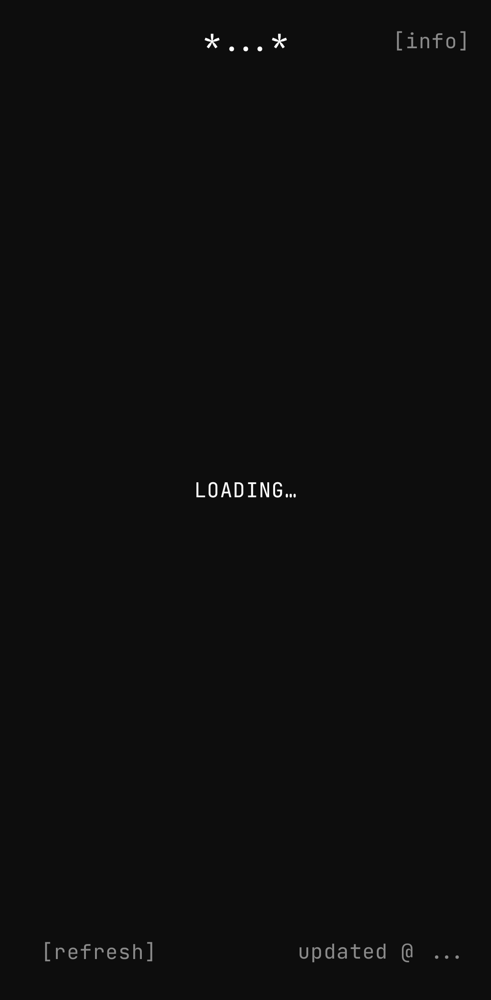
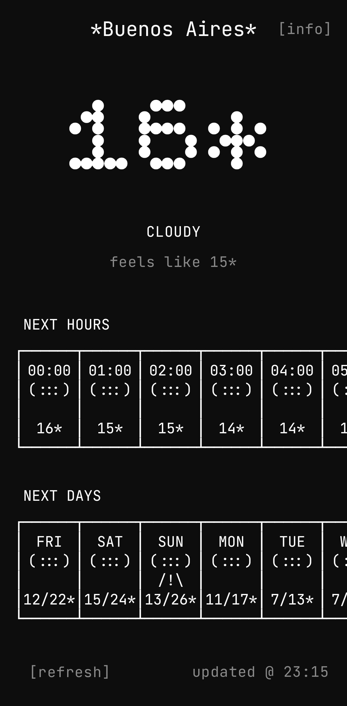
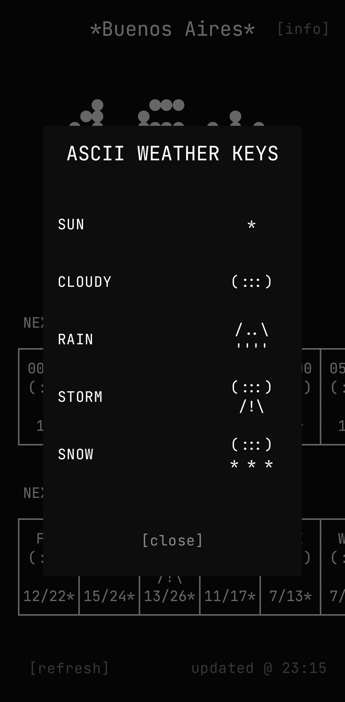

# Just the Weather

Just the Weather is a simple, minimalist, and real-time weather application designed to provide quick and accurate forecasts based on your current location.

It fetches data from the Open-Meteo API to ensure you are always prepared for the day ahead.

## Features

- Real-time weather data based on user location.
- Current temperature, apparent temperature, and weather condition.
- Hourly forecast for the next 24 hours.
- Daily forecast for the upcoming week.
- One-tap refresh to update weather information.
- Seamless permission handling for location access.
- Clean and distraction-free interface.
- Lightweight and fast performance.

## Screenshots

|                                              |                                              |
|:--------------------------------------------:|:--------------------------------------------:|
|  |  |
|  |                                              |

## Installation

### From Source Code

1. Clone this repository:
    ```bash
    git clone https://github.com/cabovianco/android-justtheweather-app.git
    ```
2. Open the project in Android Studio.
3. Build and run the app on your device or emulator.

## Technologies

- **Language:** Kotlin.
- **Architecture:** MVVM, Clean Architecture.
- **UI:** Jetpack Compose, Material Design 3, Splash Screen.
- **Remote Data:** Retrofit, Open-Meteo API.
- **Location:** Google Play Services Location.
- **Asynchronous & Data:** Kotlin Coroutines, Kotlin Flow, Kotlin Serialization.
- **Dependency Injection:** Dagger Hilt.

## App Structure

The app follows **Clean Architecture** principles, organized into the following package structure:

```text
com.cabovianco.justtheweather
├── data/                   # Implementation of data sources
│   ├── mapper/             # Data to Domain mappers
│   ├── remote/             # Retrofit API service and DTOs
│   ├── repository/         # Repository implementations
│   └── source/             # Raw data sources (Location)
│
├── di/                     # Dependency Injection modules
│
├── domain/                 # Business logic
│   ├── model/              # Domain entities
│   ├── repository/         # Repository interfaces
│   └── usecase/            # Domain operations
│
└── presentation/           # UI Layer
    ├── state/              # UI States
    ├── ui/
    │   ├── screen/         # Screens and components
    │   └── theme/          # App theme (color, type, etc.)
    └── viewmodel/          # ViewModels
```

## Domain Data Modeling

The core business logic uses the following data structures:

### `Forecast` Entity

Represents the complete weather forecast for a location.

- **Fields:**
    - `current`: The weather at the present moment (`WeatherEntry`).
    - `hourly`: A list of forecasts for the next hours (`List<WeatherEntry>`).
    - `daily`: A list of forecasts for the upcoming days (`List<WeatherEntry>`).

### `WeatherEntry` Type

Represents a specific weather measurement.

- **Fields:**
    - `date`: The date and time of the entry (`LocalDateTime`).
    - `condition`: Weather state (SUN, CLOUDY, RAIN, STORM, SNOW, UNKNOWN).
    - `temperature`: Temperature details (`WeatherTemperature`).

### `Location` Entity

Stores the coordinates and geographical information.

- **Fields:**
    - `latitude`: The latitude coordinate.
    - `longitude`: The longitude coordinate.
    - `city`: Optional city name resolved from coordinates.

## License

This project is licensed under the MIT License. See the [LICENSE](LICENSE) file for details.
